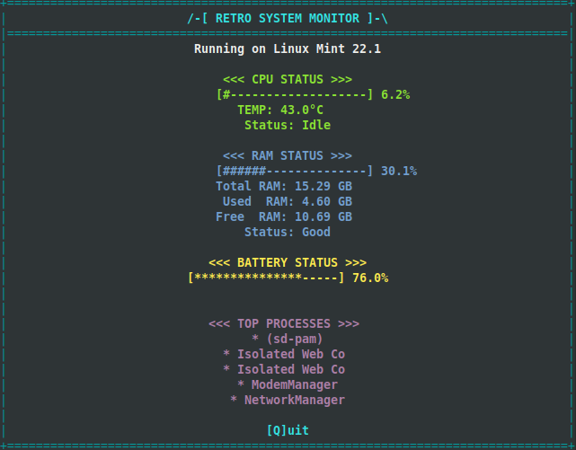

# 🎮 Retro System Monitor

[](https://en.cppreference.com/w/cpp/20)
[](https://cmake.org/)
[](https://invisible-island.net/ncurses/)
[](https://opensource.org/licenses/MIT)
[](https://www.linux.org/)

+------------------+
|  SYSTEM MONITOR  |
|   [STATUS: OK]   |
+------------------+

A Linux system monitor with a retro design!



## Key Features

- **Real-time System Monitoring**
  - CPU and RAM usage
  - Temperature monitoring
  - Battery level (if present)
  - Active processes

- **Retro-Style UI**
  - ASCII art borders and decorations
  - Colour-coded status indicators
  - Status messages
  - Centered text layout for better readability

## Technical Implementation

- **Modern C++ (C++20)**
  - Object-oriented design with clean separation of concerns
  - Smart error handling and system calls

- **System Integration**
  - Direct Linux system stats reading (`/proc`, `/sys`)
  - Real-time process monitoring
  - Hardware status tracking (CPU, RAM, Battery)

- **NCurses Library**
  - Terminal UI manipulation
  - Colour management
  - Real-time screen updates
  - Event handling

## Building and Running

### Prerequisites
- CMake (>= 3.20)
- C++20 compatible compiler
- NCurses library
- Linux system

### Build Instructions
```bash
# Clone the repository
git clone https://github.com/vladcranga/retro-system-monitor.git
cd retro-system-monitor

# Create the build directory
mkdir build && cd build

# Build the project
cmake ..
make

# Run the monitor
./retro-system-monitor
```

## Usage

- Launch the monitor to view system stats in a retro style
- Press 'q' or 'Q' to quit
- Watch for colour changes indicating system status:
  - 🟡 Yellow: Warning level
  - 🔴 Red: Critical level
  
## Licence

This project is licensed under the [MIT Licence](https://opensource.org/licenses/MIT).

## Contributing

Contributions are welcome! Feel free to submit issues and pull requests.

---
+-------------------+
|      THE END      |
+-------------------+
